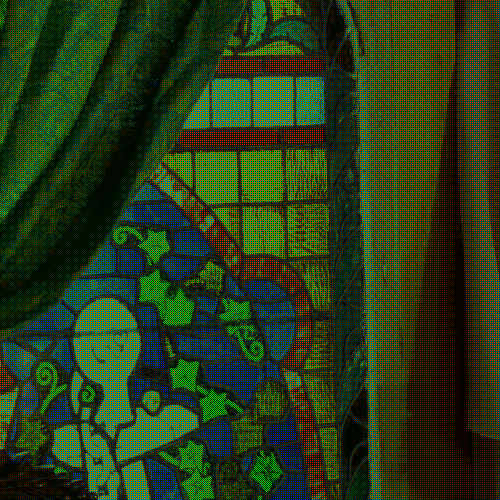
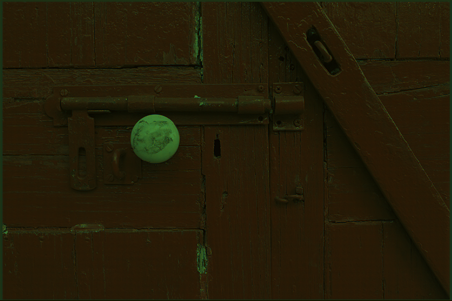
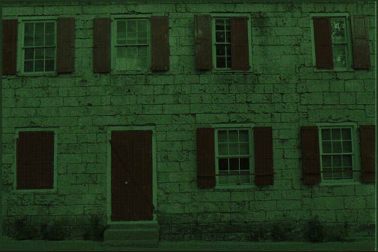
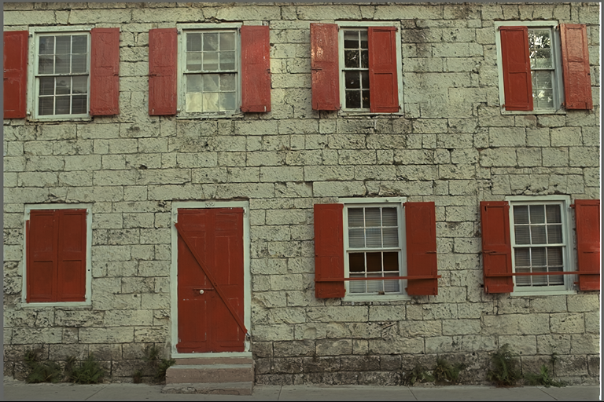

# MARN-DDJ

This repository is implementation of the "Deep Conjunct Denoising and Demosaicking a Hybrid approach based on Deep Adaptive Residual Learning".

## Requirements
- PyTorch
- torch
- torchvision 
- Numpy
- tensorboardX 
- matplotlib
- scipy
- skimage


## Results

The DnCNN-3 is only a single model for three general image denoising tasks, i.e., blind Gaussian denoising, SISR with multiple upscaling factors, and JPEG deblocking with different quality factors.

<table>
    <tr>
        <td><center>Mosaic</center></td>
         <td><center>Original</center></td>
        <td><center><b>Output from algorithm</b></center></td>
    </tr>
    <tr>
    	<td>
    		<center></center>
    	</td>
    	<td>
    		<center></center>
    	</td>
        <td>
    		<center></center>
    	</td>
    </tr>
       <tr>
    	<td>
    		<center></center>
    	</td>
    	<td>
    		<center></center>
    	</td>
        <td>
    		<center></center>
    	</td>
    </tr>
        <tr>
    	<td>
    		<center></center>
    	</td>
    	<td>
    		<center></center>
    	</td>
        <td>
    		<center></center>
    	</td>
    </tr>
        <tr>
    	<td>
    		<center></center>
    	</td>
    	<td>
    		<center></center>
    	</td>
        <td>
    		<center></center>
    	</td>
    </tr>
</table>

## Usages

### Train

When training begins, the model weights will be saved every epoch. <br />

#### MARN-JDD-S

```bash
python train.py \
  --preprocess False \
  --num_of_layers 20 \
  --mode S \
  --noiseL 25 \
  --val_noiseL 25  
```

#### MARN-JDD-B

```bash
python train.py \
  --preprocess False \
  --num_of_layers 20 \
  --mode B \             
   --gaussian_noise_level 0,25 \
   --batch_size 16 \
   --num_epochs 60 \  
```

### Test

Output results consist of noisy incomplete image and denoised complete image.

```bash
python test.py              
```
